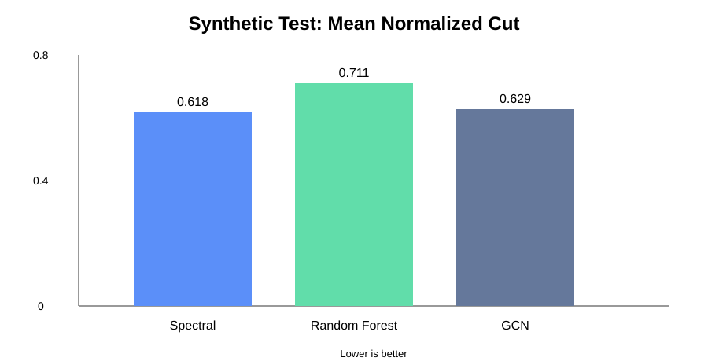
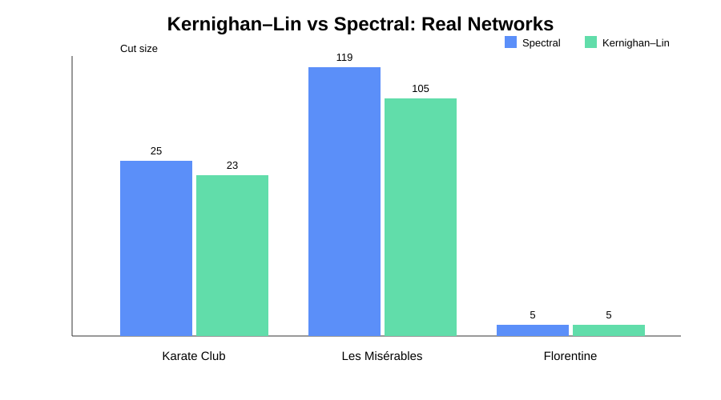

# Graph Partitioning for Network Optimization

An end-to-end machine-learning project for dividing networks into balanced partitions while reducing communication between partitions.

## Web application

The repository now includes a deployable web interface under `frontend/` and a Flask API under `backend/`.

The web app lets a user:

1. Enter a custom number of nodes.
2. Enter unweighted or weighted edges.
3. Choose Spectral, Kernighan–Lin, or ML + refinement.
4. Submit the graph to the Python backend.
5. View Partition A and Partition B.
6. View cut size, balance, normalized cut, and a visual network map.

### Run the web app locally

From the repository root:

```bash
pip install -r requirements.txt
python backend/app.py
```

The API runs at `http://localhost:5000`.

Then open `frontend/index.html` in a browser. The frontend is configured to use the local API automatically.

For a VS Code workflow, you can also serve the frontend folder with any static web server. For example, with VS Code Live Server, open `frontend/index.html` using Live Server.

### Frontend deployment

The frontend is static HTML/CSS/JavaScript, so it can later be deployed to Netlify, Vercel, GitHub Pages, or another static host.

Before deploying, edit `frontend/config.js`:

```javascript
window.GRAPH_API_URL = "https://YOUR-BACKEND-URL";
```

Deploy the `frontend/` directory as the static site.

### Backend deployment

The Flask API can be deployed separately to a Python host such as Render or Railway.

Start command:

```bash
gunicorn backend.app:app
```

The backend URL is then placed into `frontend/config.js`.

## What the project does

Given a graph G=(V,E), the system predicts a two-way partition of the nodes and evaluates:

- **Cut size** — edges crossing between partitions
- **Partition balance** — how evenly nodes are divided
- **Normalized cut**
- **Prediction accuracy** against generated spectral labels
- **Runtime**

## ML pipeline

```
Graph generation / real network
          ↓
Graph + node feature extraction
          ↓
Classical partitioning baselines
          ↓
Train / test split
          ↓
Random Forest + GCN
          ↓
Balance-constrained local refinement
          ↓
Benchmark + visualization
```

## Implemented components

### Classical algorithms
- Spectral bipartitioning using the Fiedler vector
- Kernighan-Lin baseline using NetworkX
- Balance-constrained local refinement

### Machine learning
- Random Forest node classifier
- Lightweight two-layer Graph Convolutional Network implemented directly in PyTorch
- Structural node features: degree, weighted degree, clustering coefficient, PageRank, core number, and average neighbor degree
- Balance-aware GNN inference

### Evaluation
- Cut size
- Balance score
- Normalized cut
- Accuracy versus spectral-generated labels
- Runtime benchmarking
- Hyperparameter sweep

### Datasets
The experiments include synthetic Erdős–Rényi graphs and NetworkX's built-in Karate Club, Les Misérables, and Florentine Families graph examples.

## Project structure

```
Graph_partitioning/
├── README.md
├── requirements.txt
├── backend/
│   ├── app.py
│   └── README.md
├── frontend/
│   ├── index.html
│   ├── styles.css
│   ├── app.js
│   └── config.js
├── src/
│   ├── algorithms/
│   │   ├── spectral.py
│   │   └── kernighan_lin.py
│   ├── dataset.py
│   ├── features.py
│   ├── model.py
│   ├── gnn.py
│   ├── pipeline.py
│   ├── benchmark.py
│   ├── evaluate.py
│   ├── visualize.py
│   └── cli.py
├── scripts/
│   └── train_gnn.py
├── experiments/
│   ├── run_experiments.py
│   └── compare_baselines.py
├── tests/
│   ├── test_partitioning.py
│   └── test_gnn.py
└── results/
    ├── EXPERIMENT_REPORT.md
    ├── experiment_results.json
    ├── baseline_comparison.json
    ├── synthetic_normalized_cut.svg
    └── real_network_baselines.svg
```

## Installation

```bash
python -m venv .venv

# Windows
.venv\\Scripts\\activate

# Linux/macOS
source .venv/bin/activate

pip install -r requirements.txt
```

## Run the CLI demo

```bash
python -m src.cli --nodes 40 --probability 0.12
```

## Run the full experiment

Run this from the repository root so Python can resolve the `src` package:

```bash
python -m experiments.run_experiments
```

This generates machine-readable results under `results/`.

## Run tests

```bash
python -m pytest
```

## Experimental results

A reproducible experiment was run with **100 training graphs and 30 held-out test graphs**, using 40-node Erdős–Rényi graphs with edge probability 0.12.

| Method | Mean cut size | Mean balance | Mean normalized cut |
|---|---:|---:|---:|
| Spectral | 28.23 | 0.965 | 0.618 |
| Random Forest + balance-constrained refinement | 33.70 | 0.857 | 0.775 |
| GCN + balance-constrained refinement | 26.30 | 0.902 | 0.629 |

The constrained GCN achieves a lower mean cut than spectral on this benchmark while retaining balance above 0.90. This is a prototype result, not evidence of general superiority.



### Classical baseline on real networks

| Dataset | Algorithm | Cut size | Balance | Normalized cut |
|---|---|---:|---:|---:|
| Karate Club | Spectral | 25 | 1.000 | 0.217 |
| Karate Club | Kernighan–Lin | 23 | 1.000 | 0.199 |
| Les Misérables | Spectral | 119 | 0.987 | 0.318 |
| Les Misérables | Kernighan–Lin | 105 | 0.987 | 0.265 |
| Florentine Families | Spectral | 5 | 0.933 | 0.501 |
| Florentine Families | Kernighan–Lin | 5 | 0.933 | 0.501 |



### GNN hyperparameter sweep

| Hidden dimension | Epochs | Mean normalized cut |
|---:|---:|---:|
| 16 | 20 | 0.5680 |
| 32 | 20 | 0.6085 |
| 32 | 40 | 0.6071 |
| 64 | 40 | 0.5833 |

These are exploratory results rather than statistically significant model-selection results. More seeds, larger datasets, and stronger optimization targets are needed for a research-grade conclusion.

## Important research limitation

The first supervised labels are generated by spectral partitioning. Therefore, the GNN learns to approximate a classical heuristic rather than a globally optimal partition.

The next research stage is to train against stronger optimization-generated targets, add larger real-world networks, and evaluate generalization to graph families not seen during training.

See `results/EXPERIMENT_REPORT.md` for the complete experiment report.
